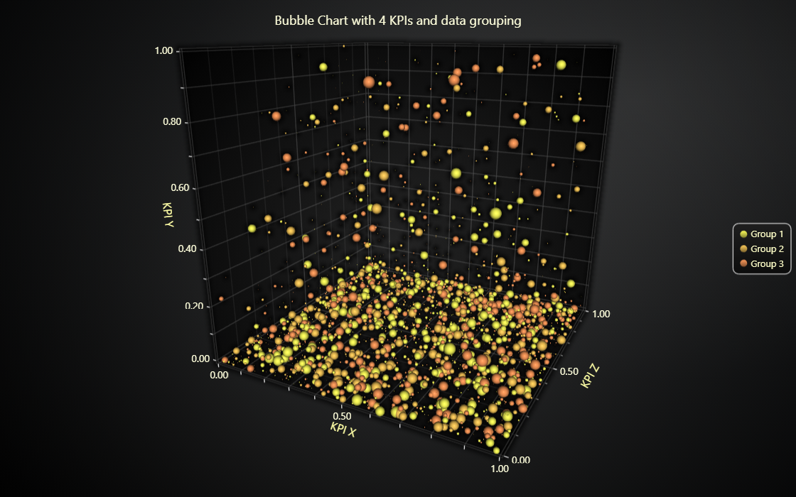

# JavaScript 3D Bubble Chart

This demo application belongs to the set of examples for LightningChart JS, data visualization library for JavaScript.

LightningChart JS is entirely GPU accelerated and performance optimized charting library for presenting massive amounts of data. It offers an easy way of creating sophisticated and interactive charts and adding them to your website or web application.

The demo can be used as an example or a seed project. Local execution requires the following steps:

-   Make sure that relevant version of [Node.js](https://nodejs.org/en/download/) is installed
-   Open the project folder in a terminal:

          npm install              # fetches dependencies
          npm start                # builds an application and starts the development server

-   The application is available at _http://localhost:8080_ in your browser, webpack-dev-server provides hot reload functionality.

## Description

Example of using LightningChart PointSeries3D for an interactive 3D Bubble Chart with individual point sizes and data grouping to different colors.

The example context takes place in a setting where the relations between four performance indicators - or data properties - have to be visualized.
In this examples case, each property is mapped to X coordinate, Y coordinate, Z coordinate and the size of the point respectively.

Furthermore, the data set is separated into three groups. This could mean for example, different products or origins of data, or other kind of classification. These groups are colored with their own unique color, and their data points can be hidden by clicking from the legend.

## API Links

* [3D chart]
* [Point series 3D]
* [Axis3D]

## Support

If you notice an error in the example code, please open an issue on [GitHub][0] repository of the entire example.

Official [API documentation][1] can be found on [LightningChart][2] website.

If the docs and other materials do not solve your problem as well as implementation help is needed, ask on [StackOverflow][3] (tagged lightningchart).

If you think you found a bug in the LightningChart JavaScript library, please contact sales@lightningchart.com.

Direct developer email support can be purchased through a [Support Plan][4] or by contacting sales@lightningchart.com.

[0]: https://github.com/Arction/
[1]: https://lightningchart.com/lightningchart-js-api-documentation/
[2]: https://lightningchart.com
[3]: https://stackoverflow.com/questions/tagged/lightningchart
[4]: https://lightningchart.com/support-services/

© LightningChart Ltd 2009-2022. All rights reserved.

[3D chart]: https://lightningchart.com/js-charts/api-documentation/v7.1.0/classes/Chart3D.html
[Point series 3D]: https://lightningchart.com/js-charts/api-documentation/v7.1.0/classes/PointSeries3D.html
[Axis3D]: https://lightningchart.com/js-charts/api-documentation/v7.1.0/classes/Axis3D.html

